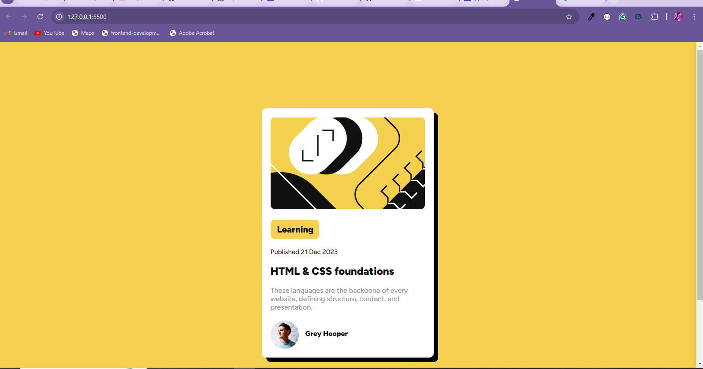

# Frontend Mentor - Blog preview card solution

This is a solution to the [Blog preview card challenge on Frontend Mentor](https://www.frontendmentor.io/challenges/blog-preview-card-ckPaj01IcS). Frontend Mentor challenges help you improve your coding skills by building realistic projects. 

## Table of contents

- [Overview](#overview)
  - [The challenge](#the-challenge)
  - [Screenshot](#screenshot)
  - [Links](#links)
- [My process](#my-process)
  - [Built with](#built-with)
  - [What I learned](#what-i-learned)
  

**Note: Delete this note and update the table of contents based on what sections you keep.**

## Overview

### The challenge

Users should be able to:

- See hover and focus states for all interactive elements on the page

### Screenshot




### Links

- Solution URL: [Add solution URL here](https://github.com/Temiloluwa16/blog-preview-card)
- Live Site URL: [Add live site URL here](https://youhttps://laura-blog-previews.netlify.app/)

## My process

### Built with

- Semantic HTML5 markup
- CSS custom properties
- Flexbox
- CSS Grid
- Mobile-first workflow


### What I learned

I learnt about how important the div element is when it comes to styling.

```html
<div class="profile">
  
  <h4>Grey Hooper</h4>
</div>
```
```css
.section-container {
    width: 300px;
    background-color: #FFFFFF;
    margin: 0 auto;
    padding: 20px;
    border-radius: 10px;
    box-shadow: 10px 10px 0 0 black;
    margin-top: 150px;
    margin-bottom: 150px;
    
}
```


